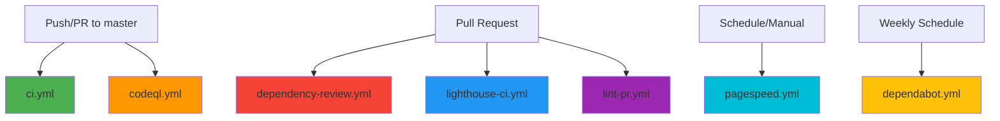

# GitHub Workflows Documentation

This directory contains GitHub Actions workflows that automate various aspects of the project's development, security, and deployment processes.

## 📋 Available Workflows

### Security & Dependencies

#### `codeql.yml` - CodeQL Security Analysis

**Trigger:** Push/PR to master, Weekly schedule (Wednesday 13:44)  
**Purpose:** Performs advanced security scanning to identify vulnerabilities in JavaScript/TypeScript code.

**Features:**

- Uses `security-extended` query suite for thorough analysis
- Scans on every push and pull request
- Weekly automated scans for proactive security monitoring

**Manual Run:** ✅ Available  
**Status Badge:** Check the Security tab on GitHub

---

#### `dependency-review.yml` - Dependency Vulnerability Scanning

**Trigger:** Pull requests to master  
**Purpose:** Reviews dependency changes in PRs to identify known security vulnerabilities.

**Features:**

- Blocks PRs with high/critical severity vulnerabilities
- Automatically comments on PRs with findings
- Prevents vulnerable packages from being merged

**Manual Run:** ❌ PR-only  
**Configuration:** Fails on `high` severity or above

---

#### `dependabot.yml` - Automated Dependency Updates

**Trigger:** Weekly (Mondays at 6:00 AM EST)  
**Purpose:** Automatically creates PRs to update dependencies and GitHub Actions.

**Features:**

- Groups minor/patch updates to reduce PR noise
- Separate PRs for major version updates
- Updates both npm packages and GitHub Actions
- Conventional commit messages (`chore:` and `ci:` prefixes)
- Auto-labels PRs with `dependencies` and `automated`

**Configuration:**

- Max 5 open PRs for npm dependencies
- Max 3 open PRs for GitHub Actions
- Can be manually triggered from GitHub UI

---

### CI/CD & Quality

#### `ci.yml` - Continuous Integration

**Trigger:** Push/PR to master  
**Purpose:** Validates code quality and ensures the project builds successfully.

**Steps:**

1. ✅ Prettier formatting check
2. ✅ ESLint (JavaScript/TypeScript linting)
3. ✅ Stylelint (CSS linting)
4. ✅ Build verification
5. 📦 Uploads build artifacts (7-day retention)

**Manual Run:** ✅ Available  
**Cache:** Uses npm cache for faster runs

---

#### `lighthouse-ci.yml` - Performance Audits on PRs

**Trigger:** Pull requests to master  
**Purpose:** Runs Lighthouse performance audits on PRs to catch performance regressions.

**Features:**

- Uses existing `.lighthouserc.json` configuration
- Uploads results as artifacts (30-day retention)
- Helps maintain performance standards

**Manual Run:** ❌ PR-only  
**Requirements:** `LHCI_GITHUB_APP_TOKEN` secret (optional)

---

#### `lint-pr.yml` - PR Title Validation

**Trigger:** PR opened/edited/synchronized  
**Purpose:** Ensures PR titles follow Conventional Commits format.

**Allowed Types:**

- `feat:` - New features
- `fix:` - Bug fixes
- `docs:` - Documentation changes
- `style:` - Code style changes
- `refactor:` - Code refactoring
- `perf:` - Performance improvements
- `test:` - Test updates
- `build:` - Build system changes
- `ci:` - CI/CD changes
- `chore:` - Other changes
- `revert:` - Reverts

**Example:** `feat: Add new contact form` ✅  
**Invalid:** `add new contact form` ❌

---

#### `pagespeed.yml` - PageSpeed Insights Badges

**Trigger:** Daily at midnight, Push to master, Manual  
**Purpose:** Generates performance badges for the README using Google PageSpeed Insights API.

**Features:**

- Tests https://portfolio.kuasar.xyz
- Generates badges for Performance, Accessibility, Best Practices, SEO
- Publishes to `badges` branch
- Color-coded badges (green ≥90, orange ≥50, red <50)

**Manual Run:** ✅ Available  
**Requirements:** `PAGESPEED_API_KEY` secret

---

## 🚀 Running Workflows Manually

Many workflows can be triggered manually from the GitHub Actions tab:

1. Go to your repository on GitHub
2. Click on **Actions** tab
3. Select the workflow you want to run
4. Click **Run workflow** (if available)
5. Select the branch and click **Run workflow**

## 🔧 Configuration Files

- **`.lighthouserc.json`** - Lighthouse CI configuration
- **`dependabot.yml`** - Dependabot settings
- **Workflow YAML files** - Individual workflow configurations

## 🛠️ Troubleshooting

### Workflow Fails

1. Check the workflow run logs in the Actions tab
2. Look for red ❌ marks to identify which step failed
3. Common issues:
   - Linting errors → Fix code style issues
   - Build failures → Check for TypeScript/syntax errors
   - Dependency issues → Run `npm ci` locally to verify

### Dependabot PRs

- **Too many PRs?** Adjust `open-pull-requests-limit` in `dependabot.yml`
- **Need to ignore a dependency?** Add to `ignore` section in `dependabot.yml`
- **Want different grouping?** Modify `groups` section

### PageSpeed Badge Not Updating

- Verify `PAGESPEED_API_KEY` secret is set correctly
- Check workflow logs for API errors
- Ensure the target URL is accessible

## 📊 Viewing Workflow Status

Workflows display their status via:

- ✅ Green checkmark = Passed
- ❌ Red X = Failed
- 🟡 Yellow dot = In progress
- ⚪ Gray circle = Skipped/Cancelled

You can also add status badges to your README:

```markdown

```

## 🔐 Required Secrets

Some workflows require GitHub secrets to be configured:

- `PAGESPEED_API_KEY` - Google PageSpeed Insights API key (for pagespeed.yml)
- `LHCI_GITHUB_APP_TOKEN` - Lighthouse CI GitHub App token (optional, for lighthouse-ci.yml)
- `GITHUB_TOKEN` - Automatically provided by GitHub Actions

To add secrets: Settings → Secrets and variables → Actions → New repository secret

## 📝 Best Practices

1. **Always run CI checks locally** before pushing:

   ```bash
   npm run check  # Runs format:check and lint
   npm run build  # Verifies build succeeds
   ```

2. **Review Dependabot PRs** before merging - especially major version updates

3. **Use conventional commits** in your PR titles to pass the lint-pr workflow

4. **Monitor security alerts** from CodeQL and Dependency Review

5. **Keep workflows updated** - Dependabot will create PRs for GitHub Actions updates

## 🔄 Workflow Dependencies



## 📚 Additional Resources

- [GitHub Actions Documentation](https://docs.github.com/en/actions)
- [Dependabot Documentation](https://docs.github.com/en/code-security/dependabot)
- [CodeQL Documentation](https://codeql.github.com/docs/)
- [Lighthouse CI Documentation](https://github.com/GoogleChrome/lighthouse-ci)
- [Conventional Commits](https://www.conventionalcommits.org/)
